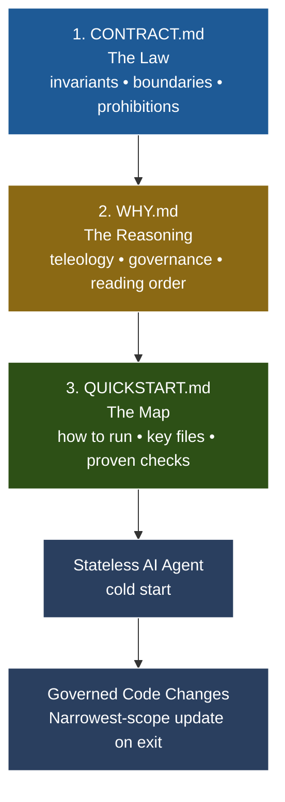

# 🏛️ contract-style-comments: The Agentic Trivium

> ▶️ Click to watch: *The Agentic Trivium explained*

> **"A system is more than the sum of its parts; it is the product of their interactions."**

This repository provides a **systems-thinking framework** for managing the interaction between human intent and AI execution. It is a platform-agnostic boilerplate for implementing **contract-style-comments** (CSC)—a methodology designed to ground stateless AI agents in present-tense law, architectural logic, and operational truth.

## 🧩 Why Systems Thinking?

In a traditional development loop, documentation is often a static "afterthought." In an **Agentic System**, documentation is a **live component** of the feedback loop. 

When you work with an AI agent (like Cursor, Zed, or Copilot), the agent is a part of your system. If the agent lacks "memory" of your invariants, the system fails. **contract-style-comments** serve as the **persistent memory layer** that ensures the agent's actions remain coupled to the system's goals.

---

## 🛠️ The Triumvirate (Core Artifacts)

To prevent "contextual drift" and "confident guessing," this framework enforces a **Required Reading Order**. Think of these as the three inputs required for the AI to successfully "re-synchronize" with your system state.

### 1. [CONTRACT.md](CONTRACT.md) — The Law (Invariants)
*   **Purpose**: Defines the "What" and the "Must."
*   **Systems View**: These are the constraints that define the system's boundaries. If an invariant is violated, the system is no longer the system you intended.
*   **Instruction**: "Read this to know what you are **not** allowed to break."

### 2. [WHY.md](WHY.md) — The Reasoning (Teleology)
*   **Purpose**: Defines the "Why" and the "Relationship."
*   **Systems View**: Explains the interconnections between artifacts. It prevents the agent from misunderstanding the *purpose* of the documentation itself.
*   **Instruction**: "Read this to understand the logic behind the split and the **Narrowest-Scope Update Rule**."

### 3. [QUICKSTART.md](QUICKSTART.md) — The Map (Operational Truth)
*   **Purpose**: Defines the "How" and the "Proven."
*   **Systems View**: The empirical interface. It lists the key files and the "Proven Checks" required to verify that the system is still functioning as intended.
*   **Instruction**: "Read this to know how to run the system and how to prove your changes work."

### Visual: The Reading Order & Handshake

---

## 🤝 The Agentic Handshake: A New Pedagogy

Using this framework changes your relationship with the AI. You are no longer just "asking for code"; you are **governing a collaborator**.

*   **Authorization**: The agent is authorized—and expected—to act as a **Governance Steward**.
*   **Responsibility**: If the agent discovers a "Missing Axiom" (a logic gap) or makes a scope-affecting change, it must update the narrowest owning artifact before the session ends.
*   **Illustration by Example**: 
    > *Human*: "Add a new billing route."
    > *Agent*: "I've added the route. I also updated `QUICKSTART.md` with the new endpoint and `CONTRACT.md` to reflect the new 'no-unauthorized-access' invariant for this path."

---

## 🚀 Getting Started

1.  **Clone/Template**: Initialize your project with this structure.
2.  **Define Invariants**: Populate `CONTRACT.md` with the "Laws" of your specific system.
3.  **Onboard the Agent**: Start every session by pointing the AI to these files:
    > *"Read the Trivium (`CONTRACT.md` -> `WHY.md` -> `QUICKSTART.md`) in order. Internalize the system invariants before proposing any code changes."*

---

## 🛠️ Customization Quickstart

To adapt this boilerplate for your project:

1. **Update CONTRACT.md**:
   - Replace the "System Invariants" section with your project's specific rules. For example, if building a web app, add: "API endpoints must return JSON; database queries must use prepared statements."
   - Customize the "Architectural Boundaries" with real constraints (e.g., "Frontend must not access the database directly; use API layer only.").

2. **Update QUICKSTART.md**:
   - Fill the "System Map" table with your actual file paths (e.g., Entry Point: `app/main.py` for a Python app).
   - Add project-specific "Proven Checks" (e.g., "Run `pytest` and ensure 90% coverage").

3. **Update WHY.md** (if needed):
   - Adjust reading order or ownership if your project has additional docs.

4. **Onboard AI Agents**:
   - Use prompts like: "Before coding, read CONTRACT.md for invariants, WHY.md for governance, QUICKSTART.md for operations."

This turns the generic template into a project-specific guide quickly.

---

*This framework is a product of the **Missing Axiom** theory. For a deep dive into the systems-thinking approach to AI collaboration, visit [WhatsOnYourBrain.com](https://whatsonyourbrain.com).*