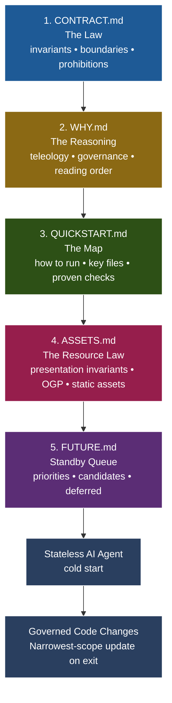

# 🏛️ Contract-Style-Comments (CSC)

[](https://www.youtube.com/watch?v=5a1NLhIiefY)
> ▶️ **[Watch the Explainer Video: The Agentic Trivium](https://www.youtube.com/watch?v=5a1NLhIiefY)**

Contract-Style-Comments (CSC) is a **domain-agnostic systems-thinking framework** that governs the interaction between human intent and stateless AI execution. It provides a structured, platform-independent boilerplate to ground AI coding agents in present-tense system law, operational truth, and presentation bounds.

---

## 🧩 The Core Philosophy

In an **Agentic System**, documentation is not a static afterthought—it is an **active component of the runtime feedback loop**. When working with stateless AI coding agents (e.g., Cursor, GitHub Copilot, Windsurf, Zed), the agent operates without permanent session memory. Without explicit grounding in your invariants, system boundaries, and operational rules, the agent is prone to confident hallucinations, code bloat, and regression.

CSC is specifically engineered to resolve two critical system failure modes:

*   **Presentation & Binary Silent Regressions (PBSRs):** Incidents where the codebase compiles perfectly, database schemas pass validation, and test runners exit `0`, but the system's static dependencies (UI media, customized graphic assets, compiled static libraries, ML model files, or local hardware registry assets) break silently or fall out of alignment.
*   **Sensory Deficit of Stateless Development:** The absolute inability of stateless AI coding agents to visually, aurally, or physically verify assets, causing them to confidently fabricate asset paths, byte offsets, binary resolutions, or visual coordinates when working outside of raw text and code parameters.

---

## 🛠️ The Spec Architecture (Trivium + Supplements)

CSC separates project governance into distinct artifacts based on their **rate of change** and **logical scope**. The system is governed by a core Triumvirate, supported by one presentation supplement and one standby roadmap queue.



### 1. [CONTRACT.md](CONTRACT.md) — The Law (Invariants)
*   **Purpose:** Defines the system's hard invariants, architectural boundaries, and absolute prohibitions.
*   **Systems View:** What the system *is* and what must *never* break. Changes the least.

### 2. [WHY.md](WHY.md) — The Reasoning (Teleology)
*   **Purpose:** Details the "why" and explains the relationships between the governing files.
*   **Systems View:** Defines the logical architecture and the rules that keep each document accurate.

### 3. [QUICKSTART.md](QUICKSTART.md) — The Map (Operational Truth)
*   **Purpose:** The empirical interface containing exact file layouts and proven run/verification checks.
*   **Systems View:** How to run, verify, and map the executable state of the repository. Changes the most.

### 4. [ASSETS.md](ASSETS.md) — The Resource Law (Presentation & Binary Invariants)
*   **Purpose:** Governs static resources, visual assets, binary blobs, localization databases, and design variables.
*   **Systems View:** The visual/binary plane. Prevents PBSRs and bridges the AI sensory deficit by treating design/binary constraints with the exact same rigor as logic.

### 5. [FUTURE.md](FUTURE.md) — Planned Intent (Standby Queue)
*   **Purpose:** A non-binding parking lot for prioritized candidates, medium-term ideas, and deferred discussions.
*   **Systems View:** Captures roadmap intent without polluting the active present-tense law.

---

## 🤝 The Agentic Handshake

Using CSC changes your relationship with AI. You are no longer merely asking for code—you are **governing a collaborator**.

1.  **Stewardship:** The AI agent is authorized—and expected—to act as a **Governance Steward** during the session.
2.  **Responsibility:** No scope-affecting code change is complete until the corresponding invariant, operational step, or asset pathway has been documented in the narrowest owning file.
3.  **Surfacing Axioms:** If the agent discovers an undocumented system assumption (a logic gap), it is expected to immediately surface and record it in `CONTRACT.md`.

---

## 🚀 Getting Started (2-Minute Setup)

1. **Clone the Boilerplate:**
   Clone this repository directly into a `./contract/` folder in the root of your project:
   ```bash
   git clone https://github.com/ajaxstardust/CONTRACT-Style-Comments.git ./contract
   ```

2. **Customize Your Rules:**
   Open the files under `./contract/` and replace the placeholder scaffolding with your project's active invariants, file maps, and asset requirements.

3. **Anchor Your AI Agent:**
   At the start of every AI chat or coding agent session, copy-paste the **Session Initialization Prompt** below to anchor the agent's context.

---

## 🤖 AI Agent Session Prompts

### 📥 1. Session Initialization (Submit at Cold Start)

```
Please read the project specification markdown documents located under the project root at `./contract/` in their strict required sequence:
1. `./contract/CONTRACT.md` (The Law / Invariants)
2. `./contract/WHY.md` (The Reasoning / Teleology)
3. `./contract/QUICKSTART.md` (The Map / Operational Truth)
4. `./contract/ASSETS.md` (The Resource Law / Presentation & Binary Invariants)
5. `./contract/FUTURE.md` (The Standby Queue / Roadmap)

IMPORTANT: Files outside `./contract/` (such as root README.md, MEMORY.md, TODO.md, or other agent-specific config files) are subordinate to the `./contract/` specification. The files inside `./contract/` represent your "One Source of Truth" and the governing law of this project.

After reading the specification, return to the user and state:
1. A brief 2-sentence summary of your understanding of this system's invariants.
2. Your top-three engineering curiosities or concerns discovered while auditing these files against the current codebase.
3. A live system verification report: Auditing the active status of the local runtime (e.g. checking running processes, active ports, database connections/schemas, package managers, virtual environments, or container boundaries described in QUICKSTART.md) to ensure the execution plane matches the documented map.
```

### 📤 2. Session Closure (Submit on Exit)

```
Please take a moment as a project steward to reconcile the Project Specification documents under `./contract/`. Review the codebase edits from this session and update the spec files to reflect any new invariants, file structures, or resource targets introduced.

CRITICAL DIRECTIVES:
1. Maintain the Governance Trust Paradox: the Contract is not a semantic prose copy of git history. Git holds chronology; the Contract holds present-tense law.
2. Ensure all updated LAST REVIEWED lines carry today's date formatted strictly as `YYYY-MM-DD-QUALIFIER` (e.g. YYYY-MM-DD-STEWARDSHIP) followed by your signature stamp `SIGNATURE: <agent-model-identity>`.
3. Adhere strictly to the Narrowest-Scope Update Rule:
   - Logical invariants/boundaries changed -> Update `./contract/CONTRACT.md`
   - Operational/run commands/file maps changed -> Update `./contract/QUICKSTART.md`
   - Visual branding/styling/binary assets changed -> Update `./contract/ASSETS.md`
   - Architectural relationships changed -> Update `./contract/WHY.md`
   - Near-term priorities/prospective roadmaps changed -> Update `./contract/FUTURE.md`
```

---

> *This framework is a product of the author's **Missing Axiom** theory. For a deep systems-thinking deep dive into AI collaboration, read the **[manifesto article](https://whatsonyourbrain.com/contract-style-comments-part-4-governance-ownership-and-scope)**.*
