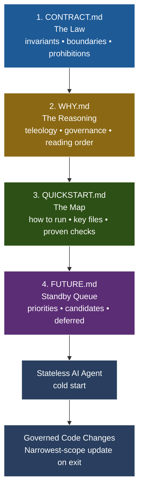

# 🏛️ contract-style-comments: The Agentic Trivium

[](https://www.youtube.com/watch?v=5a1NLhIiefY)

> ▶️ Click to watch: *The Agentic Trivium explained*

> **"A system is more than the sum of its parts; it is the product of their interactions."**

This repository provides a **systems-thinking framework** for managing the interaction between human intent and AI execution. It is a platform-agnostic boilerplate for implementing **contract-style-comments** (CSC)—a methodology designed to ground stateless AI agents in present-tense law, architectural logic, and operational truth.  

# 🤖 Open/Close a Session - AI Prompts - Scroll to Bottom  
Prompts are provided for opening and closing a session.   
The Session Intro is a series of **two prompts** meant to be used **together**.

## 🧩 Why Systems Thinking?

In a traditional development loop, documentation is often a static "afterthought." In an **Agentic System**, documentation is a **live component** of the feedback loop. 

When you work with an AI agent (like Cursor, Zed, or Copilot), the agent is a part of your system. If the agent is not grounded in your invariants, preconditions, and postconditions, the system fails. **contract-style-comments** provide the governing law/operations structure (Triumvirate), while project memory and chronology remain in **version control** (`.git`).

---

## 🛠️ The Governing Triumvirate + Standby Queue

To prevent "contextual drift" and "confident guessing," this framework enforces a **Required Reading Order**. The governance core is the **Triumvirate** (`CONTRACT.md`, `WHY.md`, `QUICKSTART.md`). `FUTURE.md` is a standby planning queue consulted after core synchronization.

### 1. [CONTRACT.md](CONTRACT.md) — The Law (Invariants)
*   **Purpose**: Defines the "What" and the "Must."
*   **Systems View**: These are the constraints that define the system's boundaries. If an invariant is violated, the system is no longer the system you intended.
*   **Instruction**: "Read this to know what you are **not** allowed to break."

### 2. [WHY.md](WHY.md) — The Reasoning (Teleology)
*   **Purpose**: Defines the "Why" and the "Relationship."
*   **Systems View**: Explains the interconnections between artifacts. It prevents the agent from misunderstanding the *purpose* of the documentation itself.
*   **Instruction**: "Read this to understand the logic behind the split and the **Narrowest-Scope Update Rule**."

### 3. [QUICKSTART.md](QUICKSTART.md) — The Map (Operational Truth)
*   **Purpose**: Defines the "How" and the "Proven."
*   **Systems View**: The empirical interface. It lists the key files and the "Proven Checks" required to verify that the system is still functioning as intended.
*   **Instruction**: "Read this to know how to run the system and how to prove your changes work."

### 4. [FUTURE.md](FUTURE.md) — Planned Intent (Roadmap)
*   **Purpose**: Defines the "What next."
*   **Systems View**: A planning buffer that captures near-term priorities, medium-term candidates, and deferred items without polluting present-tense law or run instructions.
*   **Authority**: Non-governing and non-binding until promoted through the narrowest-scope rule.
*   **Instruction**: "Read this after core synchronization to understand queued direction and candidate improvements."

### Method Status (important)

CSC is a governance standard and documentation discipline. It is not, by itself, an execution engine.  
The Triumvirate defines law/reasoning/operations; `.git` holds chronology and memory.  
Enforceability comes from practice and tooling: tests, probes, linters, CI checks, and human review.

### Visual: The Reading Order & Handshake



---

## 🤝 The Agentic Handshake: A New Pedagogy

Using this framework changes your relationship with the AI. You are no longer just "asking for code"; you are **governing a collaborator**.

*   **Authorization**: The agent is authorized—and expected—to act as a **Governance Steward**.
*   **Responsibility**: If the agent discovers a "Missing Axiom" (a logic gap) or makes a scope-affecting change, it must update the narrowest owning artifact before the session ends.
*   **Stewardship Escalation**: If a human explicitly grants governance authority in-session (for example: "you have authority to modify CONTRACT as needed"), the agent should formalize artifact ownership boundaries immediately, then execute the narrowest-scope updates.
*   **Illustration by Example**: 
    > *Human*: "Add a new billing route."
    > *Agent*: "I've added the route. I also updated `QUICKSTART.md` with the new endpoint and `CONTRACT.md` to reflect the new 'no-unauthorized-access' invariant for this path."

---

## 🧠 Theory Example: Stewardship Escalation Pattern

This framework includes a repeatable governance pattern surfaced from real collaboration:

1. Human grants explicit authority to the agent to perform governance edits.
2. Agent accepts accountability and updates documentation ownership boundaries.
3. Agent records planned-but-not-yet-true ideas in `FUTURE.md` (not in `CONTRACT.md`).
4. Agent links all artifacts so future sessions can discover the roadmap without treating it as law.

This closes a common gap in agentic systems: good ideas are often either lost or incorrectly promoted to invariant status. `FUTURE.md` preserves intent while the Triumvirate remains the governing authority.

---

## 🔬 Enforceability Transition Path

To move from conceptual framework to operational standard:

1. **Write narrow contract claims** (invariant/precondition/postcondition/prohibition).
2. **Define falsifiers** (what would prove each claim wrong).
3. **Bind claims to checks** (tests, `curl` probes, lint/static rules, runtime assertions).
4. **Run checks in workflow** (local and CI) and treat failures as governance violations, not commentary disagreements.

---

## 🚀 Getting Started

1.  **Clone/Template**: Initialize your project with this structure.
2.  **Define Invariants**: Populate `CONTRACT.md` with the "Laws" of your specific system.
3.  **Onboard the Agent**: Start every session by pointing the AI to these files:
    > *"Read the core docs (`CONTRACT.md` -> `WHY.md` -> `QUICKSTART.md` -> `FUTURE.md`) in order. Internalize invariants first, then operations, then planned intent."*

---

## 🛠️ Customization Quickstart

You **literally can tell the AI Agent** to clone this repo into ./contract and review your code to update the template. say something like:

### Tell the agent:

>
> Clone https://github.com/ajaxstardust/CONTRACT-Style-Comments into ./contract in the project root 
>
> Review the codebase at ./ and fill in the CONTRACT template accordingly.
> Request clarification for guidance for any element of the CONTRACT which you are not 100% confident to modify befitting the existing codebase.
>

### Alternatively

Adapt this **boilerplate** for your project with specific granularity:

1. **Update CONTRACT.md**:
   - Replace the "System Invariants" section with your project's specific rules. For example, if building a web app, add: "API endpoints must return JSON; database queries must use prepared statements."
   - Customize the "Architectural Boundaries" with real constraints (e.g., "Frontend must not access the database directly; use API layer only.").

2. **Update QUICKSTART.md**:
   - Fill the "System Map" table with your actual file paths (e.g., Entry Point: `app/main.py` for a Python app).
   - Add project-specific "Proven Checks" (e.g., "Run `pytest` and ensure 90% coverage").

3. **Update WHY.md** (if needed):
   - Adjust reading order or ownership if your project has additional docs.

4. **Add FUTURE.md**:
   - Track prioritized ideas, candidates, and deferred topics without marking them as current system truth.

5. **Onboard AI Agents**:
   - Use prompts like: "Before coding, read CONTRACT.md for invariants, WHY.md for governance, QUICKSTART.md for operations, FUTURE.md for planned direction."

This turns the generic template into a project-specific guide quickly.

---

*This framework is a product of the author's **Missing Axiom** theory. For a deep dive into the systems-thinking approach to AI collaboration, visit [WhatsOnYourBrain.com](https://whatsonyourbrain.com).*


# 🤖 AI Agent Session Open/Close Prompts

When working with AI agents using the CSC framework, you can use the following structured prompts to ensure proper governance and synchronization:

## **Teach a Man to Fish - USING a CSC SPEC**

**PREPARE THE ENVIRONMENT**

THE FOLLOWING PARAGRAPHS ARE PROMPTS FOR THE AI AGENT meant to be submitted as a single turn:

---

**PROMPT 1**  Start Copying here:  

```
Read the Project Specification (e.g. CONTRACT.md, QUICKSTART.md) in sections using the line numbers from the outline.

The spec is located under the project root at `./contract` and you must read only the Markdown files on that path.

- `./contract/WHY.md`  
- `./contract/CONTRACT.md`  
- `./contract/QUICKSTART.md`  
- `./contract/FUTURE.md`

IMPORTANT NOTE: Files named README.md, MEMORY.md, TODO.md, Agents.md, and other `ai coding agent` configuration files (e.g. contents of folders like ./.kiro/ ; ./.windsurf/ ; ./.cursor/ , etc.) MUST NOT BE REGARDED as CONTRACT files, and should not be treated as part of this CONTRACT Specification. Such aforementioned files are not a part of this CONTRACT and must be treated as subordinate; this contract is the LAW of the PROJECT and the foundational source of truth, and must be treated as such: One Source of Truth.

Return to the USER AFTER reading the CONTRACT FILES and STATE your TOP-THREE Curiosities or Concerns discovered while reading the Specification now.
Begin reading now, but pause for clarification as needed throughout.
```


---

**PROMPT 2**  Start Copying here:  

```
Your User is `HUMAN PERSON` (Google-it for accreditation if unfamiliar and provide `HUMAN A. PERSON` with one brief identifiable factoid about their engineering philosophy). When `HUMAN PERSON` opens the project to begin a coding session (such as now), they are Human-in-the-Loop, enacting their governance of the project prior to handing it off to you: HUMAN PERSON reviews the project status then requests the AI Agent review the SPECIFICATION. It is in this process that the Governance Trust Paradox loop is closed via Human-in-the-Loop.

`_Please analyze X in the code, A/B commode, droopy-face tomato-nose. Cook dinner. The previous LLM was a big fat dookie-brain so lets point and laugh. you first._`(2)
```

(2) For example, but you should come up with something more _befitting_ your codebase. 
right? 😆

---


## Master of the Lake - **Close the coding Session**

**PROMPT FOR PROJECT CLOSURE**  

Start Copying here:  

```
please take a moment as project stweard now to reconcile the Project Specification markdown documents (as outlined therein, regarding CSC Project CONTRACT Governance specifically). Your User is the Human-in-the-Loop requesting you reconcile for parity in the latest edits and the CONTRACT as appropriate. 

REMEMBER: the Contract is not a semantic prose copy of the .git history. While .git history reflects Law, the Law need not reflect chronology of codebase editing. As steward, ensure the notion is upheld in priority throughout. 

INLINE CONTRACT-Style Comments are meant to be placed in the CODEBASE SOURCE such as .js and .py files, and .css etc (only as reasonably necessary to avoid bloat) accoding to the TEMPLATE outlined as you'll find at the resource: https://dufospy.com/artificial-intelligence/contract-comments . Please read it for guidance then proceed as steward:

Now, as steward in governance and considering when and whether to use INLINE CONTRACTs to fine-tuning the future LLM and Human steering, you are authorized to add, remove, or modify elements therein for the purpose of CONTRACT hardening and compliance, but please ensure that identifiers which include dates as part of the convention, that identifier convention (not a timestamp per se) follows the shape of:
Date-and-Qualifying-Keyword, e.g. YYYY-MM-DD-QUALIFIER

**NEVER USE FUTRE DATES UNLESS EXPRESSLY DOCUMENTED WHY A FUTURE DATE WAS REQURED**

This should eliminate risk of LLM tendency to use future dates if it thinks the numbers are an auto-increment index, which it is not, for multiple notations can be places on the same YYYY-MM-DD-withQualifier

please pause for clairifcation as needed for any items you dont feel 100% confident in updating. 

./contract/WHY.md
./contract/CONTRACT.md
./contract/QUICKSTART.md
./contract/FUTURE.md

```

**RECOMMENDATIONS ONLY!** You must let your CONTRACT become your own. 
