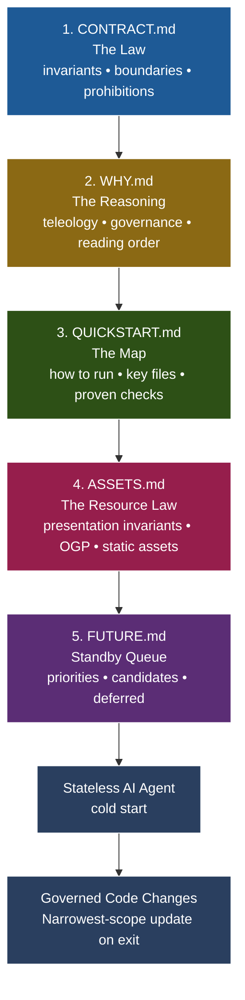

# 🏛️ Contract-Style-Comments (CSC)

[](https://youtu.be/1Fux-E4eE50?si=npSGfw4R5dvHly90)
> ▶️ **[Watch the Explainer Video: The Agentic Trivium](https://youtu.be/1Fux-E4eE50?si=npSGfw4R5dvHly90)**

Contract-Style-Comments (CSC) is a **domain-agnostic systems-thinking framework** that governs the interaction between human intent and stateless AI execution. It provides a structured, platform-independent boilerplate to ground AI coding agents in present-tense system law, operational truth, and presentation bounds.

---

## 🧩 The Core Philosophy

In an **Agentic System**, documentation is not a static afterthought—it is an **active component of the runtime feedback loop**. When working with stateless AI coding agents (e.g., Cursor, GitHub Copilot, Windsurf, Zed), the agent operates without permanent session memory. Without explicit grounding in your invariants, system boundaries, and operational rules, the agent is prone to confident hallucinations, code bloat, and regression.

CSC is specifically engineered to resolve two critical system failure modes:

*   **Presentation & Binary Silent Regressions (PBSRs):** Incidents where the codebase compiles perfectly, database schemas pass validation, and test runners exit `0`, but the system's static dependencies (UI media, customized graphic assets, compiled static libraries, ML model files, or local hardware registry assets) break silently or fall out of alignment.
*   **Sensory Deficit of Stateless Development:** The absolute inability of stateless AI coding agents to visually, aurally, or physically verify assets, causing them to confidently fabricate asset paths, byte offsets, binary resolutions, or visual coordinates when working outside of raw text and code parameters.

---

## 🛠️ The Spec Architecture (Trivium + Supplements)

CSC separates project governance into distinct artifacts based on their **rate of change** and **logical scope**. The system is governed by a core Triumvirate, supported by one presentation supplement and one standby roadmap queue.



### 1. [CONTRACT.md](CONTRACT.md) — The Law (Invariants)
*   **Purpose:** Defines the system's hard invariants, architectural boundaries, and absolute prohibitions.
*   **Systems View:** What the system *is* and what must *never* break. Changes the least.

### 2. [WHY.md](WHY.md) — The Reasoning (Teleology)
*   **Purpose:** Details the "why" and explains the relationships between the governing files.
*   **Systems View:** Defines the logical architecture and the rules that keep each document accurate.

### 3. [QUICKSTART.md](QUICKSTART.md) — The Map (Operational Truth)
*   **Purpose:** The empirical interface containing exact file layouts and proven run/verification checks.
*   **Systems View:** How to run, verify, and map the executable state of the repository. Changes the most.

### 4. [ASSETS.md](ASSETS.md) — The Resource Law (Presentation & Binary Invariants)
*   **Purpose:** Governs static resources, visual assets, binary blobs, localization databases, and design variables.
*   **Systems View:** The visual/binary plane. Prevents PBSRs and bridges the AI sensory deficit by treating design/binary constraints with the exact same rigor as logic.

### 5. [FUTURE.md](FUTURE.md) — Planned Intent (Standby Queue)
*   **Purpose:** A non-binding parking lot for prioritized candidates, medium-term ideas, and deferred discussions.
*   **Systems View:** Captures roadmap intent without polluting the active present-tense law.

---

## 🤝 The Agentic Handshake

Using CSC changes your relationship with AI. You are no longer merely asking for code—you are **governing a collaborator**.

1.  **Stewardship:** The AI agent is authorized—and expected—to act as a **Governance Steward** during the session.
2.  **Responsibility:** No scope-affecting code change is complete until the corresponding invariant, operational step, or asset pathway has been documented in the narrowest owning file.
3.  **Surfacing Axioms:** If the agent discovers an undocumented system assumption (a logic gap), it is expected to immediately surface and record it in `CONTRACT.md`.

---

## 🚀 Getting Started (2-Minute Setup)

1. **Clone the Boilerplate:**
   Clone this repository directly into a `./contract/` folder in the root of your project:
   ```bash
   git clone https://github.com/ajaxstardust/CONTRACT-Style-Comments.git ./contract
   ```

2. **Customize Your Rules:**
   Open the files under `./contract/` and replace the placeholder scaffolding with your project's active invariants, file maps, and asset requirements.

3. **Anchor Your AI Agent:**
   At the start of every AI chat or coding agent session, copy-paste the **Session Initialization Prompt** below to anchor the agent's context.

---

## 🤖 AI Agent Session Prompts

> 📘 **Inline Contract Reference Standard:** For the precise visual formatting and visual hierarchy of inline codebase contracts, refer to the authoritative [DufoSPY Specification Template](https://dufospy.com/artificial-intelligence/contract-comments).

### 🧠 The Human-Centric Grounding Handshake (Cognitive Anchoring)
Before presenting specific technical directions, it is highly recommended to introduce your **cognitive working environment** to the LLM. 

Providing a personal introduction—such as framing the `./contract/` framework as a vital externalized memory support to counter cognitive load, short-term memory gaps, or busy development contexts—transforms the LLM from a generic responder into a highly protective, empathetic **Steward of the System**. This anchors the AI’s intent to maintain strict consistency, prevent regression, and defend your codebase from logic drift.

---

### 📥 PHASE 1: Project Context Initialization (Cold Start)
*Submit this prompt at the start of a session to establish strict spec ingestion.*

```
Initialize Project Context using the Contract-Style-Comments (CSC) methodology. Read the following Markdown files located in the project's `./contract/` directory using line-number indexing to ensure full ingestion of the active system Specification:

    ./contract/WHY.md (Intent & Philosophy)
    ./contract/CONTRACT.md (The Law / Invariants)
    ./contract/QUICKSTART.md (Implementation Entry)
    ./contract/ASSETS.md (Presentation & Resource Invariants)
    ./contract/FUTURE.md (Roadmap & Scaling)

DIRECTIONS:
1. Verify the integrity of these files.
2. Once read, DO NOT return a verbose summary of the files.
3. Instead, identify and return the top-three technical curiosities or structural concerns where the current project state might conflict with the 'Law' established in these documents.

Confirm you have completed this step, and present any concerns before we proceed to Phase 2.
```

---

### ⚙️ PHASE 2: Live Codebase and Pipeline Audit
*Submit this prompt to verify the system's operational and structural state.*

```
We will now run a comprehensive audit of the active repository state.

DIRECTIONS:
1. Run `git status` to provide a clean repository report (but do not commit or push yet).
2. Verify you are using the most recent specification of CSC by cross-referencing your findings with the authoritative blueprint at: https://github.com/ajaxstardust/CONTRACT-Style-Comments
3. Scan the core codebase files for INLINE CONTRACT comments. Evaluate whether these inline comments are highly targeted steering mechanisms (compliant with the DufoSPY standard: https://dufospy.com/artificial-intelligence/contract-comments) or redundant, bloated comments that should be cleaned up.
4. Verify the active status of all critical environment pipelines and database connections relevant to this project (such as Python virtual environments, Gunicorn proxies, local SQLite databases, Nginx/Apache bindings, or Node.js packages).

SUMMARY REPORT FORMAT:
- Provide a concise 2-sentence summary of your overall discoveries.
- State the top-three curiosities or concerns regarding the current operational state versus the ideal specification state.
- List the verified status of all system pipelines and active local runtime boundaries.
```

---

### 💡 Pro-Tips for "Contract-Style" Prompting

#### ⚓ 1. The "Law" Anchor (Short-Circuiting Drift)
If the LLM begins to hallucinate, introduce bloated code, or drift from the design system, use this **Short-Circuit Prompt**:
> *"Check Section [X] of `contract/CONTRACT.md`. Does your last suggestion violate the established Law of this system? Realign your response with the invariants."*

#### ⚡ 2. Performance & Hardware Constraints
Add hardware-specific runtime requirements directly to Phase 2 to optimize model output:
> *"Optimize all code suggestions for [Your Framework, e.g., Laravel 12 / React 19] standards, and tailor execution efficiency for local CPU/GPU model processing."*

---

### 📤 Session Closure (Stewardship Handshake on Exit)
*Submit this prompt when wrapping up development to commit the session's learnings.*

```
Please take a moment as a project steward to reconcile the Project Specification documents under `./contract/`. Review the codebase edits from this session and update the spec files to reflect any new invariants, file structures, or resource targets introduced.

CRITICAL DIRECTIVES:
1. Maintain the Governance Trust Paradox: the Contract is not a semantic prose copy of git history. Git holds chronology; the Contract holds present-tense law.
2. Ensure all updated LAST REVIEWED lines carry today's date formatted strictly as `YYYY-MM-DD-QUALIFIER` (e.g. YYYY-MM-DD-STEWARDSHIP) followed by your signature stamp `SIGNATURE: <agent-model-identity>`.
3. Adhere strictly to the Narrowest-Scope Update Rule:
   - Logical invariants/boundaries changed -> Update `./contract/CONTRACT.md`
   - Operational/run commands/file maps changed -> Update `./contract/QUICKSTART.md`
   - Visual branding/styling/binary assets changed -> Update `./contract/ASSETS.md`
   - Architectural relationships changed -> Update `./contract/WHY.md`
   - Near-term priorities/prospective roadmaps changed -> Update `./contract/FUTURE.md`
```

---

> *This framework is a product of the **Missing Axiom** theory. For a deep systems-thinking deep dive into AI collaboration, read the **[manifesto article](https://whatsonyourbrain.com/contract-style-comments-part-4-governance-ownership-and-scope)**.*
